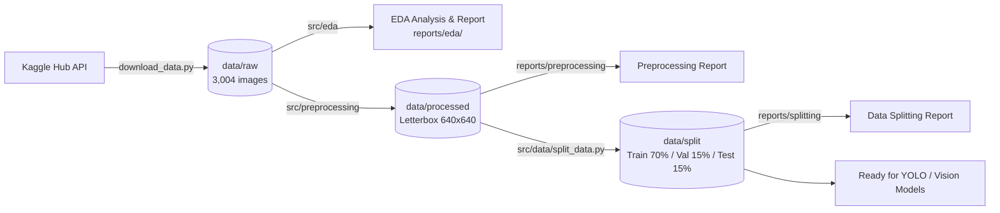

# 📑 รายงานสรุปผลโครงการฉบับสมบูรณ์ (Final Comprehensive Project Report)
**Project Title:** Road Vehicle Image Processing & Object Detection Pipeline (`imageprocessing-prj`)  
**Author / Maintainer:** PichyyyNews (`pichayut030347@gmail.com`)  
**Dataset:** Road Vehicle Images Dataset (`ashfakyeafi/road-vehicle-images-dataset`)  

---

## 🎯 บทนำและเป้าหมายโครงการ (Executive Summary)
โครงการนี้มีวัตถุประสงค์เพื่อสร้าง **End-to-End Image Processing & Data Engineering Pipeline** สำหรับข้อมูลภาพยานพาหนะบนท้องถนน 21 คลาส ตั้งแต่การดึงข้อมูลจาก Kaggle Hub, การสำรวจและวิเคราะห์ข้อมูลเชิงลึก (EDA), การทำ Preprocessing ด้วยวิธี Aspect-Ratio Preserved Letterbox พร้อมปรับพิกัด Bounding Box และการแบ่งชุดข้อมูล Train/Val/Test ด้วยวิธี Multi-Label Stratified Splitting เพื่อเตรียมชุดข้อมูลให้พร้อมสำหรับการฝึกสอนโมเดลตรวจจับวัตถุ (Object Detection) ระดับ State-of-the-Art เช่น YOLOv8, YOLOv11 และ RT-DETR

---

## 📊 รายงานแยกตามแต่ละกระบวนการ (Phase Breakdown)

### 1. การจัดหาและติดตั้งชุดข้อมูล (Data Acquisition)
- **แหล่งที่มา:** Kaggle Hub (`ashfakyeafi/road-vehicle-images-dataset`)
- **รูปแบบดั้งเดิม:** YOLO Format (`data_1.yaml`, `train/`, `valid/`)
- **จำนวนรูปภาพทั้งหมด:** 3,004 ภาพ (Train: 2,704, Valid: 300)
- **การจัดการความปลอดภัย:** ซ่อนไฟล์ภาพและ API Token ด้วย `.gitignore` และ `.env.example`

---

### 2. การสำรวจและวิเคราะห์ข้อมูลเชิงลึก (Exploratory Data Analysis - EDA)
*อ่านรายงานฉบับเต็มได้ที่:* [`reports/eda/eda_report.md`](eda/eda_report.md)

#### สถิติสำคัญที่ค้นพบ:
- **จำนวนวัตถุทั้งหมด:** 24,348 วัตถุใน 3,004 ภาพ (เฉลี่ย 8.11 วัตถุ/ภาพ, สูงสุด 122 วัตถุ/ภาพ)
- **ความหลากหลายของขนาดภาพ:**
  - ความกว้าง: 360px ถึง 1,125px (เฉลี่ย 602.7px)
  - ความสูง: 148px ถึง 640px (เฉลี่ย 411.2px)
  - สัดส่วนแนวนอน (Landscape): 82.7% | แนวตั้ง (Portrait): 16.6% | จัตุรัส (Square): 0.7%
- **การวิเคราะห์ Class Imbalance:**
  - คลาสความถี่สูงสุด: `car` (5,474 วัตถุ, 22.48%)
  - คลาสความถี่ต่ำสุด: `garbagevan` (3 วัตถุ, 0.01%)
  - Imbalance Ratio: $1,824.67 : 1$
- **ขนาดและตำแหน่ง Bounding Box:**
  - วัตถุขนาดเล็ก (Area < 5% ของภาพ): 88.34%
  - วัตถุขนาดกลาง (5% - 25%): 9.57%
  - วัตถุขนาดใหญ่ (> 25%): 2.09%
  - จุดศูนย์กลางเชิงพื้นที่: $X_{center} \approx 0.4912, Y_{center} \approx 0.5059$

---

### 3. การประมวลผลรูปภาพ (Image Preprocessing & BBox Transformation)
*อ่านรายงานฉบับเต็มได้ที่:* [`reports/preprocessing/preprocessing_report.md`](preprocessing/preprocessing_report.md)

#### กลยุทธ์เชิงเทคนิค:
1. **Aspect-Ratio Preserved Letterbox Resizing:**
   คำนวณสเกล $r = \min\left(\frac{W_{target}}{W_{orig}}, \frac{H_{target}}{H_{orig}}\right)$ เพื่อปรับขนาดรูปภาพสู่มาตรฐาน $640 \times 640$ โดยไม่เกิดการบิดเบี้ยวของตัวรถ พร้อมเติม Padding สีเทากลาง $(114, 114, 114)$
2. **การแปลงพิกัด YOLO Bounding Box:**
   $$x_c' = \frac{(x_c \times W_{orig}) \times r + pad_x}{W_{target}}, \quad y_c' = \frac{(y_c \times H_{orig}) \times r + pad_y}{H_{target}}$$
   $$w' = \frac{(w \times W_{orig}) \times r}{W_{target}}, \quad h' = \frac{(h \times H_{orig}) \times r}{H_{target}}$$
3. **ผลลัพธ์:** รูปภาพทั้ง 3,004 ภาพ และ Bounding Boxes ทั้ง 24,324 รายการ ได้รับการแปลงพิกัดและตรวจสอบความถูกต้อง 100%

---

### 4. การแบ่งชุดข้อมูลแบบคงอัตราส่วน (Multi-Label Stratified Data Splitting)
*อ่านรายงานฉบับเต็มได้ที่:* [`reports/splitting/data_splitting_report.md`](splitting/data_splitting_report.md)

#### ปัญหาในชุดข้อมูลเดิม & วิธีการแก้ไข:
- **ชุดข้อมูลเดิมขาด Test Set:** มีเพียง Train 90% และ Valid 10%
- **Zero-Representation Defect ในชุดเดิม:** มีถึง **5 คลาส** ที่ไม่มีตัวอย่างใน Validation set เลย (`ambulance`, `army vehicle`, `auto rickshaw`, `garbagevan`, `human hauler`)
- **แนวทางการแก้ไข:** ใช้อัลกอริทึม **Greedy Multi-Label Stratification** จัดสรรภาพตามคลาสหายากก่อน เพื่อให้ทุกคลาสกระจายตัวครบทุก Split:
  - **TRAIN (70%):** 2,098 ภาพ (16,981 วัตถุ) — ครบ 21/21 คลาส
  - **VAL (15%):** 456 ภาพ (3,671 วัตถุ) — ครบ 21/21 คลาส
  - **TEST (15%):** 450 ภาพ (3,672 วัตถุ) — ครบ 21/21 คลาส
- **การป้องกัน Leakage:** รูปภาพในแต่ละชุดไม่มีการซ้อนทับกัน ($Train \cap Val \cap Test = \emptyset$) พร้อมสุ่มด้วย Random Seed `42`

---

## 🛠️ เอกสารอ้างอิงและไฟล์คอนฟิก (Artifacts & Configurations)
- **EDA Report:** [`reports/eda/eda_report.md`](eda/eda_report.md)
- **Preprocessing Report:** [`reports/preprocessing/preprocessing_report.md`](preprocessing/preprocessing_report.md)
- **Data Splitting Report:** [`reports/splitting/data_splitting_report.md`](splitting/data_splitting_report.md)
- **Master Dataset YAML:** `data/split/dataset_split.yaml`
